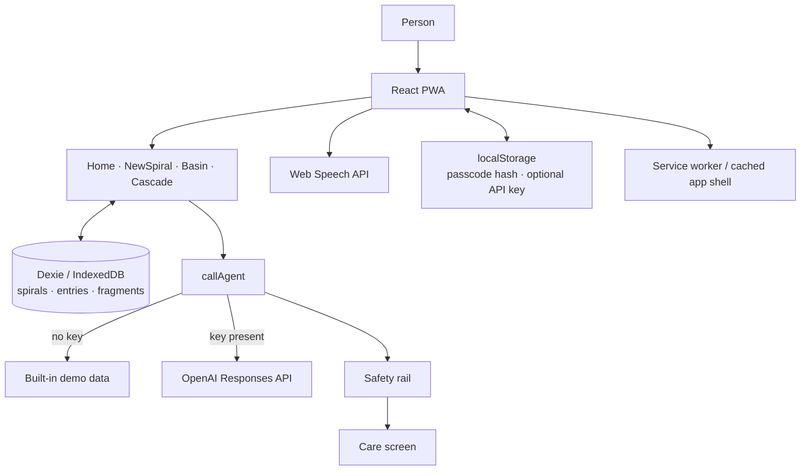

# Untangle

Untangle is a local-first PWA for stepping back from a thought spiral. Write or dictate the thought, and Untangle turns it into a small visual map: a replay can be sifted into what happened and what was added; a projection can be traced through its feared chain.

The app is designed for a hackathon submission: focused, private, and usable without an account.

## What it does

- Captures a thought by text or Web Speech API dictation.
- Diagnoses Replay, Projection, Rumination, or Deliberation and creates a map with the OpenAI Responses API.
- Lets people lift, settle, or release replay fragments in the Basin; projection fears can be expanded and released in the Cascade.
- Saves spirals and their lifecycle entirely in IndexedDB, so returning to a spiral resumes its saved state.
- Supports follow-up dumps: new fragments arrive and familiar ones return to play with a marker.
- Includes a keyless demo mode and a safety rail for crisis language.

## Architecture



## How this was built

Untangle was built end-to-end in one shared Codex session, with human direction and acceptance decisions guiding the work.

### Codex

The entire implementation was authored by Codex (`gpt-5.6-terra`). It scaffolded each milestone from `AGENTS.md`, ported the reference prototypes onto the real data layer, and fixed issues found during manual testing—including Cascade ordering, interrupted-save recovery, and the lifted-wisp UX. It generated the Home backdrop with `gpt-image-2` after a tool failure by falling back to the CLI, and ran a `/review` security audit with zero findings before push.

### GPT-5.6

In-app intelligence uses `gpt-5.6-luna` through the OpenAI Responses API directly from the browser.

See the [full build timeline and session stats](docs/build-session.html).

## Run locally

```bash
npm install
npm run dev
```

Open the local URL shown by Vite. To use the live analysis engine, open the engine control on the Home screen and paste an OpenAI API key. It stays in that browser and is sent only to OpenAI. Without a key, the app uses its built-in demo data so the full interaction can still be explored.

Useful commands:

```bash
npm test
npm run build
```

## Try these

- **Replay:** “I keep replaying yesterday’s meeting because I stumbled over my words and now I’m sure everyone thinks I’m incompetent.” → **Basin**
- **Projection:** “What if I miss this deadline, get fired, and then lose my apartment?” → **Cascade**
- **Rumination:** “Why do I always ruin good friendships, and what does it say about me that I keep doing this?” → **Cascade** with a dedicated-screen note
- **Deliberation:** “Should I accept the safer offer or take the role that pays less but could teach me more?” → **Cascade** with a dedicated-screen note

## PWA and privacy

Untangle registers an installable PWA service worker and caches its app shell. Thought data stays on-device in IndexedDB; the only network request is an optional OpenAI analysis call. Existing spirals remain available offline after the app has loaded once.

You can optionally add a local passcode as a privacy curtain for a shared laptop. It is not encryption: saved thought data remains in this browser’s local storage, and clearing Untangle’s site data removes both the passcode and the saved spirals.

For the final device check, install the production build in a Chromium browser, create a spiral, then enable airplane mode and reopen the library.

## Technology

React, Vite, vite-plugin-pwa, Dexie/IndexedDB, Web Speech API, the OpenAI Responses API with `gpt-5.6-luna` in-app, and Codex with `gpt-5.6-terra` for the build.
